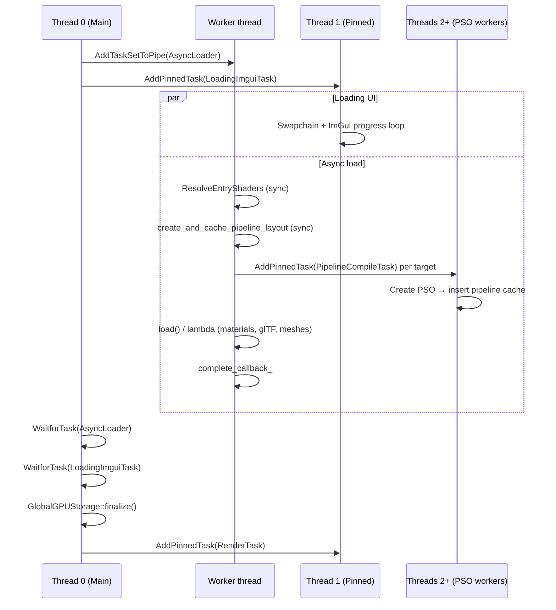
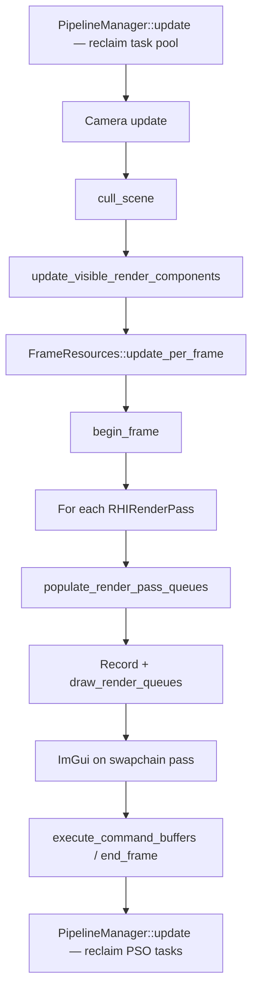

# Ocarina Vulkan

A modular Vulkan renderer built around **enkiTS** task scheduling, **async pipeline (PSO) compilation**, and an **ECS-driven** draw path. GPU work is submitted from a dedicated render thread; heavy compilation and culling run on worker threads without blocking the main SDL event loop.

---

## Architecture Overview

```
┌─────────────────────────────────────────────────────────────────────────┐
│                         Application (tests / game)                      │
│  Create Device → define shader Entries → AsyncLoader → Renderer::run()   │
└─────────────────────────────────────────────────────────────────────────┘
                                      │
                                      ▼
┌─────────────────────────────────────────────────────────────────────────┐
│  Renderer                                                                 │
│  • Owns enki::TaskScheduler + RenderTask + LoadingImguiTask              │
│  • PipelineManager singleton (shader/layout/PSO caches, task pool)       │
│  • Scene / Camera / render passes / per-frame ECS updates                │
└─────────────────────────────────────────────────────────────────────────┘
          │                    │                         │
          ▼                    ▼                         ▼
   GlobalGPUStorage      FrameResources           PipelineManager
   (mega VB/IB)         (global UBO, bindless)   (async PSO compile)
```

---

## Thread Model

The scheduler is initialized in `Renderer` with the default enkiTS configuration (`hardware_concurrency()` threads). Thread **0** is the thread that constructed `Renderer` (typically the main thread).

| Thread | Role | Pinned tasks / work |
|--------|------|---------------------|
| **0 — Main** | Init, `Renderer::run()`, SDL event loop | Blocks on `WaitforTask` during load; does not submit draw calls after load |
| **1 — Render** | GPU submission | `RenderTask` (infinite frame loop), `LoadingImguiTask` (loading screen) |
| **2…N−1 — Workers** | CPU parallelism | `AsyncLoader`, `RendererPrimitiveCullTask`, `PipelineCompileTask` (round-robin) |

**PSO worker pinning:** `PipelineManager::next_worker_thread_num()` round-robins across threads `2…N−1` so PSO creation does not compete with the render loop on thread 1 (when `N ≥ 3`).

---

## Lifecycle Phases

### Phase 1 — Initialization (main thread)

Typical application setup:

1. Create `Device` and `Renderer`.
2. Create **render passes** (swapchain and/or dynamic-rendering offscreen targets) and call `renderer.add_render_pass()`.
3. Build `PipelineCompileTask::Entry` list (shader file paths).
4. Configure `AsyncLoader` / `GltfAsyncLoader` with optional `set_compile_targets()` mapping each entry to a render pass.
5. Call `renderer.set_async_loader()` and `renderer.run()`.

Render passes must exist **before** async load so PSOs can be compiled against the correct `RHIRenderPass`.

### Phase 2 — Async load (`Renderer::run()`)



**AsyncLoader** (`src/framework/async_loader.cpp`) runs as a single-partition task set on a worker:

1. **`run_pipeline_compile_tasks()`** — calls `PipelineManager::compile_targets()`:
   - Resolves shaders synchronously per unique `Entry` (`Device::create_shader_from_file`, driver shader cache).
   - Caches pipeline layouts synchronously (descriptor set layouts + `RHIPipelineLayout`).
   - Submits one **async** `PipelineCompileTask` per `PipelineCompileTarget` `{ Entry*, RHIRenderPass* }` (no wait).
2. Runs the load lambda or `GltfAsyncLoader::load()` — creates materials, meshes, scene.
3. Invokes `complete_callback_` (wire primitives, set scene, etc.).

**GltfAsyncLoader** performs glTF parsing, geometry staging (`GlobalGPUStorage::append_mesh`), texture loading, and material creation on the same loader worker thread (not further parallelized).

After load, **main thread** calls `GlobalGPUStorage::finalize()` to upload the mega vertex/index buffers, then starts `RenderTask`.

### Phase 3 — Steady-state rendering (`RenderTask`)

`RenderTask` is pinned to **thread 1** and runs an infinite loop until shutdown.



**Per-frame culling** (`Renderer::cull_scene`):

1. Grid-level frustum cull on the scene (single-threaded).
2. If a spatial grid exists: `RendererPrimitiveCullTask` runs SIMD AABB tests in parallel across visible cells; the **render thread waits** (`WaitforTask`) before continuing.
3. If culling is disabled: all scene entity indices are used directly.

---

## Pipeline Compilation

`PipelineCompileTask` is the unified compile unit. One task handles **one `Entry` + one `RHIRenderPass`** (or one runtime `PipelineState` + pass).

### Execute steps (worker thread, pinned)

```
Resolve shaders (skip if handles already valid)
        ↓
create_and_cache_pipeline_layout  (keyed by VS + PS handles)
        ↓
create_pipeline (PSO, pass-specific)
        ↓
insert_pipeline_cache
        ↓
task pool Release (deferred until enkiTS marks task complete)
```

### Caches (`PipelineManager`)

| Cache | Key | Value |
|-------|-----|-------|
| Shader | `(type, path, options, entry)` | `handle_ty` (Vulkan driver cache) |
| Pipeline layout | `(VS handle, PS handle)` | `RHIPipelineLayout*` |
| Graphics PSO | `(PipelineState.ForCacheKey(), RHIRenderPass*)` | `RHIPipeline*` |

`PipelineState::ForCacheKey()` normalizes compared fields so hash/equality match across `Material` and compile-task states (avoids padding-related cache misses).

### Runtime PSO creation

Each frame, `populate_render_pass_queues()`:

1. Groups visible entities by `PipelineState` in `RHIRenderPass` queues.
2. Calls `PipelineManager::enqueue(state, pass)` for missing PSOs.

`draw_render_queues()` looks up the PSO and **skips the entire queue** if it is not ready yet — no render-thread stall:

```cpp
RHIPipeline* pipeline = PipelineManager::instance().get_pipeline(pipeline_state, render_pass);
if (pipeline == nullptr) {
    continue;
}
```

PSOs compile asynchronously on worker threads; the next frame picks them up once cached.

### Task pool

`PipelineCompileTaskPool` recycles task objects:

```cpp
PipelineCompileTask* task = taskPool.Acquire();
task->Initialize(...);
scheduler.AddPinnedTask(task);
// In Execute():
taskPool.Release(this);  // deferred until GetIsComplete()
```

`PipelineManager::update()` calls `task_pool.reclaim()` at the start and end of each frame.

---

## Data Flow: Shader Paths to Draw

```
PipelineCompileTask::Entry  (VS/PS paths or compute path)
        │
        ▼  ResolveEntryShaders (sync on loader thread)
handle_ty shaders in Entry
        │
        ├─► create_and_cache_pipeline_layout
        │
        ├─► PipelineCompileTask (async) → PSO per render pass
        │
        ▼
Material(device, vs, ps)  →  PipelineState + material descriptor set
        │
        ▼
Primitive.set_material / set_mesh (geometry slice into GlobalGPUStorage)
        │
        ▼  [each frame, render thread]
populate_render_pass_queues  →  enqueue missing PSOs
draw_render_queues         →  bind pipeline, globals, material UBO, draw_indexed
```

---

## Key Components

| Component | Location | Responsibility |
|-----------|----------|----------------|
| `Renderer` | `src/framework/renderer.{h,cpp}` | Scheduler, load orchestration, draw path |
| `RenderTask` | `src/framework/render_task.{h,cpp}` | Pinned render loop (thread 1) |
| `LoadingImguiTask` | `src/framework/loading_imgui_task.{h,cpp}` | Loading-screen ImGui on swapchain |
| `AsyncLoader` | `src/framework/async_loader.{h,cpp}` | Worker-thread load + compile kickoff |
| `GltfAsyncLoader` | `src/framework/gltf_async_loader.{h,cpp}` | glTF scene / geometry / materials |
| `PipelineManager` | `src/framework/pipeline_manager.{h,cpp}` | Layout/PSO caches, enqueue, compile_targets |
| `PipelineCompileTask` | `src/framework/pipeline_compile_task.{h,cpp}` | Shader resolve + layout + PSO unit |
| `RendererPrimitiveCullTask` | `src/framework/renderer_primitive_cull_task.h` | Parallel SIMD frustum cull |
| `GlobalGPUStorage` | `src/framework/global_gpu_storage.{h,cpp}` | CPU mesh staging → mega VB/IB |
| `FrameResources` | `src/framework/frame_resources.{h,cpp}` | Global UBO + bindless descriptor sets |
| `Material` | `src/framework/material.{h,cpp}` | `PipelineState`, per-material descriptors |
| `RHIRenderPass` | `src/rhi/renderpass.{h,cpp}` | Per-pass pipeline render queues |

---

## Multi-Pass Example

`test-vulkan-offscreen` uses two render passes and two compile targets:

```cpp
async_loader.set_compile_targets({
    { &pipeline_entries[0], offscreen_pass },   // triangle → offscreen RT
    { &pipeline_entries[1], swapchain_pass },   // textured quad → swapchain
});
```

Each target gets its own async `PipelineCompileTask`. PSOs are pass-specific because Vulkan pipeline state includes attachment formats (including dynamic rendering targets).

---

## Design Principles

1. **Render thread never waits for PSO creation** — missing PSOs are skipped; compilation overlaps with GPU work.
2. **Shaders and pipeline layouts resolve synchronously during load** so `Material` construction has valid handles and descriptor layouts.
3. **One compile task = one Entry + one render pass** — clear ownership, pool-friendly recycling.
4. **Mega-buffer geometry** — all meshes share `GlobalGPUStorage` vertex/index buffers; primitives reference slices.
5. **Bindless-ready materials** — descriptor set layouts come from cached pipeline layouts; globals/bindless sets live in `FrameResources`.

---

## Example Tests

| Test | Demonstrates |
|------|----------------|
| `test-vulkan-triangle` | Minimal async load + single pass |
| `test-vulkan-offscreen` | Dynamic rendering pass + swapchain, two compile targets |
| `test-load-gltf` | `GltfAsyncLoader`, large scene |
| `test-culling` | Parallel frustum culling, shared material |

Build with CMake (Visual Studio generator shown):

```bash
cmake -B build -G "Visual Studio 17 2022"
cmake --build build --config Debug --target test-vulkan-triangle
```

Binaries are written to `bin/Debug/` (or `Release`).
