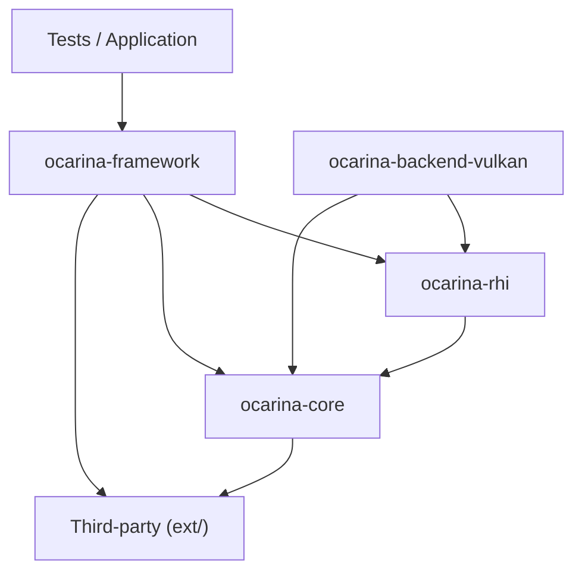
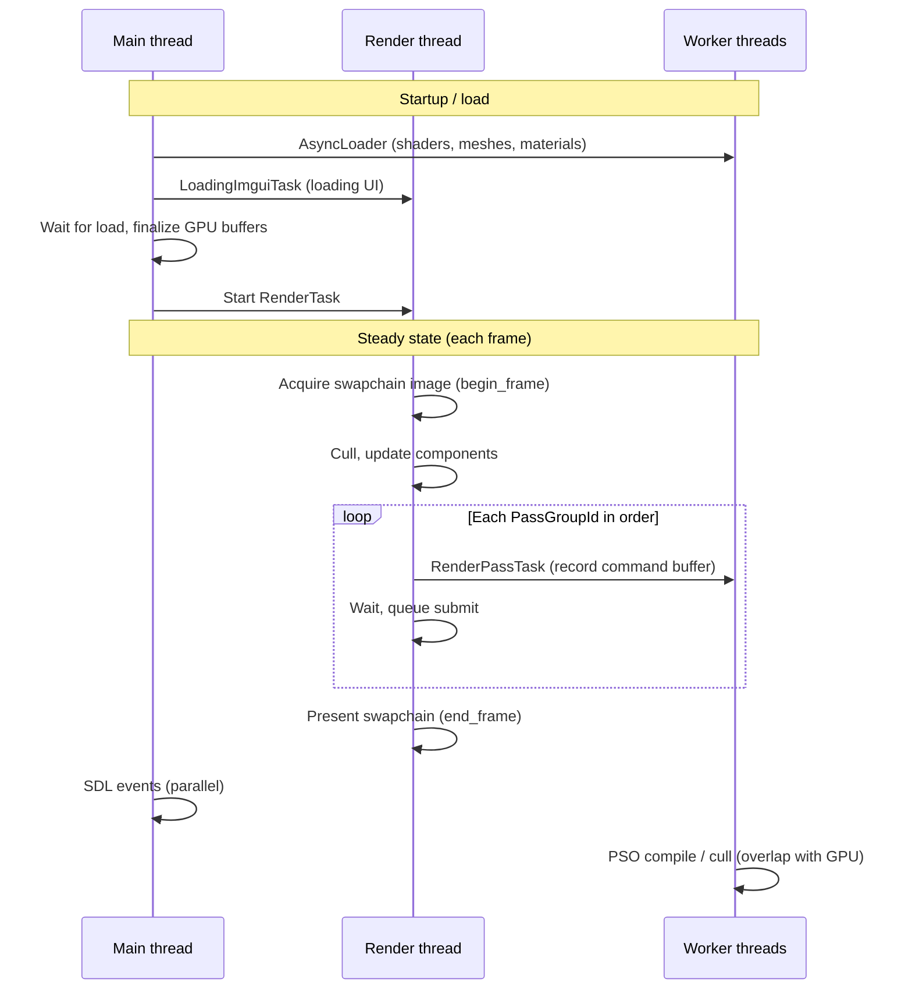

# Ocarina Vulkan

## 1. About This Project

**Ocarina Vulkan** is a personal graphics engine and learning sandbox built on the Vulkan API. It is not a production game engine; it is a place to experiment with rendering techniques, API usage, and engine structure in a controlled codebase.

The project exists for two main goals:

- **Vulkan graphics API learning** — swapchain and offscreen passes, dynamic rendering (Vulkan 1.3 with classic render-pass fallback), descriptor sets, pipeline state, texture upload, and glTF loading.
- **Multithreaded, modern rendering architecture** — job scheduling with enkiTS, a dedicated render thread for GPU submission, async pipeline (PSO) compilation, parallel frustum culling, and staged resource loading without blocking the main SDL event loop.

Sample applications under `src/tests/` exercise triangle rendering, offscreen targets, bindless textures, culling, and glTF scenes.

---

## 2. Modules

The engine is split into layers. Applications and tests sit on top of **ocarina-framework**; framework code talks to **ocarina-rhi**; the Vulkan backend implements RHI on top of **ocarina-core**.



### ocarina-core

Foundation library shared across the project: STL wrappers, math types, logging, hashing, threading helpers, image utilities, and other engine-agnostic utilities. It has no knowledge of Vulkan or rendering.

### ocarina-rhi

Render Hardware Interface — a backend-agnostic graphics layer. It defines `Device`, `Texture`, buffers, `RHIRenderPass`, `CommandBuffer`, pipeline state, and descriptor abstractions. Application and framework code depend on RHI types, not on Vulkan handles directly.

### ocarina-backend-vulkan

Vulkan implementation of the RHI, loaded as a backend module. It owns instance/device/swapchain setup, command buffers, pipelines, dynamic rendering vs. classic render passes, shader compilation (via DXC/SPIRV-Cross), and resource creation. **ocarina-rhi** dispatches into this backend at runtime.

### ocarina-framework

High-level rendering and scene layer: `Renderer`, ECS (`EntityComponentSystem`), scene/camera/primitives, `PipelineManager` and async `PipelineCompileTask`, `GlobalGPUStorage`, `FrameResources`, glTF/async loaders, ImGui integration, and pass-group recording (`PassGroupId` → `RenderPassTask`). This is where multithread scheduling and the per-frame render loop live.

### Third-party references (under `src/ext/`)

| Library | Role |
|---------|------|
| **Vulkan SDK** | Graphics API |
| **SDL3** | Window and input |
| **enkiTS** | Job scheduler / thread pool |
| **Dear ImGui** | Debug and loading UI |
| **EASTL / mimalloc** | Containers and allocation |
| **spdlog** | Logging |
| **SPIRV-Cross** | Shader reflection and cross-compile |
| **tinygltf / tinyexr / stb** | Asset and image I/O |

---

## 3. Multithread Rendering Architecture

Scheduling uses **enkiTS** with `hardware_concurrency()` worker threads. Thread **0** is the thread that constructs `Renderer` (typically the main thread).

### Thread roles

| Thread | Responsibility |
|--------|----------------|
| **Main (0)** | Application setup, `Renderer::run()`, waits on async load, SDL event loop after load |
| **Render (1, pinned)** | `RenderTask` — per-frame update, dispatch recording jobs, **swapchain acquire** (`begin_frame`), **graphics queue submit** (`execute_command_buffers`), **present** (`end_frame`); `LoadingImguiTask` during load |
| **Cmd record (workers)** | `RenderPassTask` — command buffer recording (`begin` / render passes / draw / `end`) per `PassGroupId`; dispatched from the render thread, executed on an enkiTS worker (`m_SetSize = 1` per group) |
| **Workers (2…N−1)** | `AsyncLoader`, parallel frustum cull (`RendererPrimitiveCullTask`), async `PipelineCompileTask` (PSO creation) |

### How work is dispatched



**Main thread** kicks off loading and then runs the window loop. It does not record draw commands after the render thread starts.

**Render thread** owns the frame loop: camera update, culling, queue population, and orchestration of **RenderPassTask** instances (grouped by `PassGroupId` — e.g. Offscreen, GBuffer, UI). Each non-empty group records on a worker; the render thread waits, submits recorded command buffers to the graphics queue, and presents the swapchain image when the frame ends.

**Worker threads** handle CPU-heavy work that should not block presentation: asset loading, SIMD frustum culling, pipeline creation, and **command buffer recording** when `RenderPassTask` runs. The render thread dispatches one recording task per non-empty pass group, waits for completion, then submits the recorded buffers. Missing PSOs are skipped for the current frame rather than stalling the render thread.

---

## 4. Building and Examples

**Requirements:** CMake 3.x, Visual Studio 2022 (or compatible C++20 toolchain), Vulkan SDK.

```bash
cmake -B build -G "Visual Studio 17 2022"
cmake --build build --config Debug --target test-vulkan-triangle
```

Binaries are written to `bin/Debug/` (or `Release`).

| Target | Description |
|--------|-------------|
| `test-vulkan-triangle` | Minimal triangle + swapchain |
| `test-vulkan-offscreen` | Offscreen RT → swapchain blit (`PassGroupId::Offscreen` then `UI`) |
| `test-vulkan-texture` | Textured quad |
| `test-vulkan-bindless` | Bindless sampling |
| `test-culling` | Parallel frustum culling |
| `test-asyncLoadGLTF` | glTF scene via `GltfAsyncLoader` |

Pass registration example:

```cpp
renderer.pass_group(PassGroupId::Offscreen).add_render_pass(offscreen_pass);
renderer.pass_group(PassGroupId::UI).add_render_pass(swapchain_pass);
```

A frame graph for automatic pass dependencies and resource barriers is planned as a follow-up; the current design uses explicit pass groups and ordered recording.
