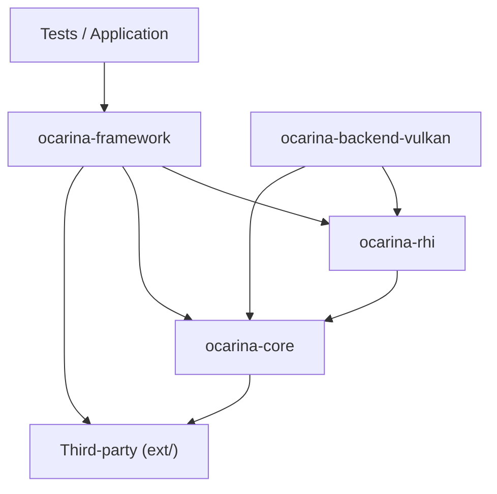
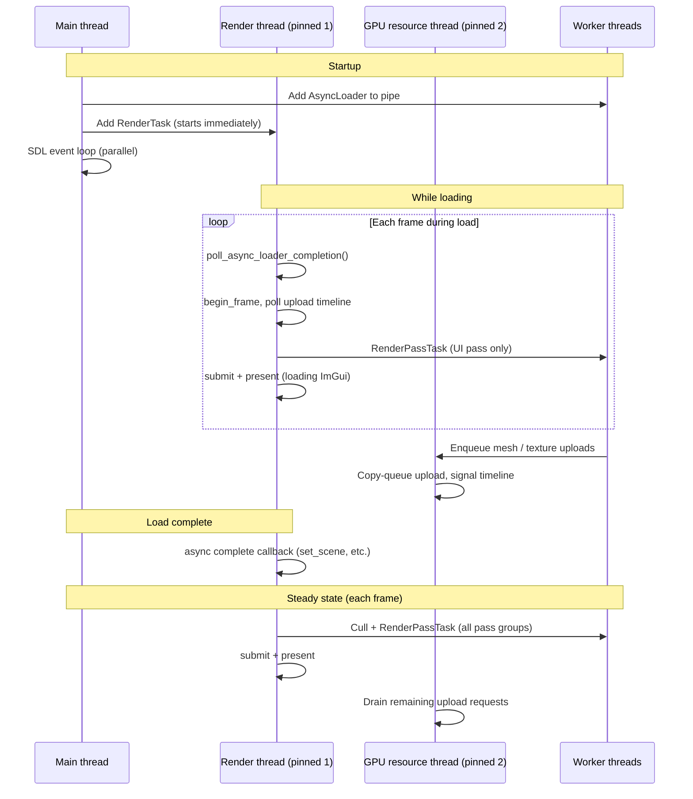
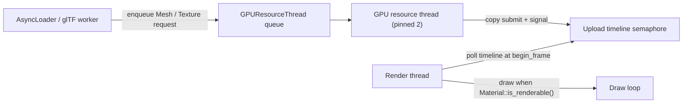

# Ocarina Vulkan

## 1. About This Project

**Ocarina Vulkan** is a personal graphics engine and learning sandbox built on the Vulkan API. It is not a production game engine; it is a place to experiment with rendering techniques, API usage, and engine structure in a controlled codebase.

The project exists for two main goals:

- **Vulkan graphics API learning** — swapchain and offscreen passes, dynamic rendering (Vulkan 1.3 with classic render-pass fallback), descriptor sets, pipeline state, bindless textures, timeline-semaphore upload sync, and glTF loading.
- **Multithreaded, modern rendering architecture** — job scheduling with enkiTS, a dedicated render thread for GPU submission, a dedicated GPU resource thread for CPU→GPU uploads, async pipeline (PSO) compilation, parallel frustum culling, and staged resource loading without blocking the main SDL event loop.

During async load, the **same render thread** that presents the swapchain also records the loading UI (`PassGroupId::UI`) while worker threads parse assets. There is no separate loading/present thread.

Sample applications under `src/tests/` exercise triangle rendering, offscreen targets, bindless textures, culling, and glTF scenes.

---

## 2. Modules

The engine is split into layers. Applications and tests sit on top of **ocarina-framework**; framework code talks to **ocarina-rhi**; the Vulkan backend implements RHI on top of **ocarina-core**.


```mermaid
flowchart TB
    App["Tests / Application"]
    FW["ocarina-framework"]
    RHI["ocarina-rhi"]
    VK["ocarina-backend-vulkan"]
    Core["ocarina-core"]
    Ext["Third-party (ext/)"]

    App --> FW
    FW --> RHI
    RHI --> Core
    FW --> Core
    VK --> RHI
    VK --> Core
    Core --> Ext
    FW --> Ext
```

### ocarina-core

Foundation library shared across the project: STL wrappers, math types, logging, hashing, threading helpers, image utilities, and other engine-agnostic utilities. It has no knowledge of Vulkan or rendering.

### ocarina-rhi

Render Hardware Interface — a backend-agnostic graphics layer. It defines `Device`, `Texture`, buffers, `RHIRenderPass`, `CommandBuffer`, pipeline state, and descriptor abstractions. Application and framework code depend on RHI types, not on Vulkan handles directly.

### ocarina-backend-vulkan

Vulkan implementation of the RHI, loaded as a backend module. It owns instance/device/swapchain setup, command buffers, pipelines, dynamic rendering vs. classic render passes, shader compilation (via DXC/SPIRV-Cross), timeline semaphores for upload sync, and resource creation. **ocarina-rhi** dispatches into this backend at runtime.

### ocarina-framework

High-level rendering and scene layer: `Renderer`, ECS (`EntityComponentSystem`), scene/camera/primitives, `PipelineManager` and async `PipelineCompileTask`, `GPUResourceThread` / `MeshBufferAllocator` / `GlobalGPUStorage`, `FrameResources`, glTF/async loaders, ImGui integration, and pass-group recording (`PassGroupId` → `RenderPassTask`). This is where multithread scheduling and the per-frame render loop live.

### Third-party references (under `src/ext/`)

| Library | Role |
|---------|------|
| **Vulkan SDK** | Graphics API |
| **SDL3** | Window and input |
| **enkiTS** | Job scheduler / thread pool |
| **Dear ImGui** | Debug and loading UI |
| **EASTL / mimalloc** | Containers and allocation |
| **spdlog** | Logging |
| **SPIRV-Cross** | Shader reflection and cross-compile |
| **tinygltf / tinyexr / stb** | Asset and image I/O |

---

## 3. Multithread Rendering Architecture

Scheduling uses **enkiTS**. `Renderer` requests at least **3** task threads so pinned roles stay distinct from the worker pool. Thread **0** is the thread that constructs `Renderer` (typically the main thread).

### Thread roles

| Thread | Responsibility |
|--------|----------------|
| **Main (0)** | Application setup, `Renderer::run()`, SDL event loop (runs in parallel with the render thread after load starts) |
| **Render (1, pinned)** | `RenderTask` — per-frame update, poll async loader completion, **during load**: record and present **UI pass only** (loading progress via ImGui), **steady state**: cull, update components, acquire swapchain (`begin_frame`), poll upload timeline, dispatch `RenderPassTask` recording jobs, submit graphics queue, present (`end_frame`) |
| **GPU resource (2, pinned)** | `GPUResourceThread` — serializes Vulkan **CPU→GPU uploads** on a global timeline semaphore: mesh geometry into paged mega VB/IB (`MeshBufferAllocator`), sampler texture creation, bindless descriptor update queues |
| **Cmd record (workers)** | `RenderPassTask` — command buffer recording (`begin` / render passes / draw / `end`) per `PassGroupId`; dispatched from the render thread, executed on an enkiTS worker (`m_SetSize = 1` per group) |
| **Workers (3…N−1)** | `AsyncLoader` / `GltfAsyncLoader`, parallel frustum cull (`RendererPrimitiveCullTask`), async `PipelineCompileTask` (PSO creation) |

### Startup and loading flow

`Renderer::run()` starts **both** the async loader (worker) and `RenderTask` (pinned render thread) immediately. The main thread does **not** wait for the loader before presentation begins.

While `is_async_loading()` is true:

1. The render thread skips culling and scene draws.
2. Only `PassGroupId::UI` is recorded (swapchain clear + ImGui via `loading_gui_impl_`).
3. The loader worker parses assets and enqueues GPU uploads.
4. When the loader finishes, `poll_async_loader_completion()` runs on the render thread and invokes the app’s complete callback (e.g. `set_scene`, switch ImGui to frame info).
5. Steady-state rendering begins on the next frames (all pass groups, culling, draws).


```mermaid
sequenceDiagram
    participant Main as Main thread
    participant Render as Render thread (pinned 1)
    participant GPURes as GPU resource thread (pinned 2)
    participant Worker as Worker threads

    Note over Main,Worker: Startup
    Main->>Worker: Add AsyncLoader to pipe
    Main->>Render: Add RenderTask (starts immediately)
    Main->>Main: SDL event loop (parallel)

    Note over Render,Worker: While loading
    loop Each frame during load
        Render->>Render: poll_async_loader_completion()
        Render->>Render: begin_frame, poll upload timeline
        Render->>Worker: RenderPassTask (UI pass only)
        Render->>Render: submit + present (loading ImGui)
    end
    Worker->>GPURes: Enqueue mesh / texture uploads
    GPURes->>GPURes: Copy-queue upload, signal timeline

    Note over Render,Main: Load complete
    Render->>Render: async complete callback (set_scene, etc.)

    Note over Main,Worker: Steady state (each frame)
    Render->>Worker: Cull + RenderPassTask (all pass groups)
    Render->>Render: submit + present
    GPURes->>GPURes: Drain remaining upload requests
```

### GPU resource uploads (`GPUResourceThread`)

Loader and main threads prepare CPU data, then **enqueue** work; they do not call Vulkan create/upload APIs for meshes and sampler textures directly.


```mermaid
flowchart LR
    Loader["AsyncLoader / glTF worker"]
    Queue["GPUResourceThread queue"]
    GPURes["GPU resource thread (pinned 2)"]
    Timeline["Upload timeline semaphore"]
    Render["Render thread"]

    Loader -->|"enqueue Mesh / Texture request"| Queue
    Queue --> GPURes
    GPURes -->|"copy submit + signal"| Timeline
    Render -->|"poll timeline at begin_frame"| Timeline
    Render -->|"draw when Material::is_renderable()"| Draw["Draw loop"]
```

| Resource | What the loader does | What the GPU resource thread does | When it becomes drawable |
|----------|----------------------|-----------------------------------|---------------------------|
| **Mesh** | Build CPU geometry, enqueue `MeshGPUResourceRequest` | Allocate into **32MB first-fit pages** (`MeshBufferAllocator`), upload VB/IB streams, set `Mesh` to `GPU_Ready` | Draw skips until `Mesh` is `GPU_Ready` |
| **Sampler texture** | `ResourceManager::create_texture` **reserves a bindless index immediately**, returns `TextureHandle`, enqueues `TextureGPUResourceRequest` | Create Vulkan texture, signal upload timeline value, bind into reserved slot, `queue_bindless_texture_update` | Draw skips until `Material::is_renderable()` (upload timeline + bindless flush) |

Texture uploads signal a **global timeline semaphore** owned by `GPUResourceThread`. Each `Texture` stores the timeline value for its upload; the render thread polls the completed value at `begin_frame` and `Material::is_renderable()` compares against it.

`RenderComponent` stores a **mesh id** (resolved via `ResourceManager`); geometry offsets live on `Mesh` as a page-local `MeshGeometrySlice`. The draw loop binds VB/IB **by page** and avoids rebinding when the page does not change.

Render targets used as framebuffer attachments are still created immediately on the caller (they must exist before render-pass setup); sampler textures and meshes stay fully async on the GPU resource thread.

### How work is dispatched (steady state)

**Main thread** kicks off loading and runs the window loop. It does not record draw commands.

**Render thread** owns the frame loop: camera update (when not loading), **dispatch of the parallel frustum culling job** (`RendererPrimitiveCullTask` onto worker threads, then wait), queue population, and orchestration of **RenderPassTask** instances (grouped by `PassGroupId` — e.g. Offscreen, GBuffer, UI). Each non-empty group records on a worker; the render thread waits, submits recorded command buffers to the graphics queue, and presents the swapchain image when the frame ends.

**GPU resource thread** owns a single queue of `GPUResourceRequest`s so Vulkan buffer/texture creation and copy-queue uploads stay serialized and off the render and loader threads.

**Worker threads** handle CPU-heavy work that should not block presentation: asset parsing, SIMD frustum culling, pipeline creation, and **command buffer recording** when `RenderPassTask` runs. Missing PSOs, meshes that are not yet `GPU_Ready`, or materials that fail `is_renderable()` are skipped for the current frame rather than stalling the render thread.

---

## 4. Building, glTF Scenes, and Examples

### Build

**Requirements:** CMake 3.x, Visual Studio 2022 (or compatible C++20 toolchain), Vulkan SDK.

```bash
cmake -B build -G "Visual Studio 17 2022"
cmake --build build --config Debug --target test-asyncLoadGLTF
```

Binaries are written to `bin/Debug/` (or `Release`). Run from the repository root so relative paths to `res/` resolve correctly.

### Tracy profiler (optional)

[Tracy](https://github.com/wolfpld/tracy) is integrated as a git submodule at `src/ext/tracy` (v0.11.1).

```bash
git submodule update --init src/ext/tracy
cmake -B build -DOCARINA_ENABLE_TRACY=ON
cmake --build build --config Debug --target test-vulkan-triangle
```

Run the test, then connect with the [Tracy desktop app](https://github.com/wolfpld/tracy/releases). Instrument code with `core/profiler.h` macros (`OC_PROFILE_FUNCTION`, `OC_PROFILE_SCOPE_N`, `OC_PROFILE_FRAME_MARK`). See `src/ext/tracy/INTEGRATION.md` for manual setup without a submodule.

### glTF scene resources in this repo

Sample scenes live under `res/`. Each scene is a folder with a `glTF/` subfolder containing the `.gltf` file, a `.bin` buffer, and texture images referenced by URI.

| Scene | Path | Notes |
|-------|------|-------|
| **Sponza** | `res/Sponza/glTF/Sponza.gltf` | Large interior; many `.jpg` / `.png` textures + `Sponza.bin` |
| **Flight Helmet** | `res/FlightHelmet/glTF/FlightHelmet.gltf` | Smaller PBR asset; textures + `FlightHelmet.bin` |

PBR mesh shading for glTF uses the built-in shaders:

- `res/shaderlibrary/builtin/mesh.vert`
- `res/shaderlibrary/builtin/mesh.frag`

Parsing is done with **tinygltf** (`src/ext/tinygltf/`). Geometry and textures are prepared on the loader worker, then uploaded on **`GPUResourceThread`** via `GlobalGPUStorage` / `ResourceManager` (paged mesh buffers and early bindless indices).

### How glTF loading works

`GltfAsyncLoader` extends `AsyncLoader` and runs on an enkiTS **worker thread** when you call `renderer.run()`:

1. **Compile pipelines** — resolve shaders, cache pipeline layouts, kick off async PSO creation for the swapchain pass.
2. **Parse glTF** — load `.gltf` / `.glb` via tinygltf; resolve external images relative to the glTF file’s directory.
3. **Build scene** — walk the node graph, enqueue mesh uploads, create `Material`s, reserve bindless texture indices and enqueue texture uploads, populate a `Scene` of `Primitive`s.
4. **Complete callback** (render thread, after load) — wire push constants and assign `renderer.set_scene()`. GPU uploads continue (or finish) on `GPUResourceThread`; draws skip meshes/materials that are not yet ready.

While loading, the **render thread** records and presents the **UI pass only** (`PassGroupId::UI`) with ImGui loading progress. The **main thread** continues processing SDL events in parallel — no separate loading/present thread.

Register the swapchain pass before `run()`:

```cpp
renderer.pass_group(PassGroupId::UI).add_render_pass(render_pass);
renderer.set_loading_gui_impl_callback([&](const CommandBuffer& cmd) { imgui_renderer.render(cmd); });
renderer.set_render_gui_impl_callback([&](const CommandBuffer& cmd) { imgui_renderer.render(cmd); });
```

### glTF loading example

Based on `src/tests/test_load_gltf.cpp`:

```cpp
#include "framework/gltf_async_loader.h"
#include "framework/pipeline_compile_task.h"
#include "framework/pass_group_id.h"
// ...

const fs::path repo_root = /* path to project root */;
const fs::path gltf_path = repo_root / "res/Sponza/glTF/Sponza.gltf";

std::vector<PipelineCompileTask::Entry> pipeline_entries;
pipeline_entries.push_back(PipelineCompileTask::Entry::make_graphics(
    fs::absolute(repo_root / "res/shaderlibrary/builtin/mesh.vert").string(),
    fs::absolute(repo_root / "res/shaderlibrary/builtin/mesh.frag").string()));

GltfAsyncLoader gltf_loader(
    &renderer.task_scheduler(),
    &device,
    &pipeline_entries,
    fs::absolute(gltf_path).string());

RHIRenderPass* render_pass = device.create_render_pass(swapchain_pass_creation);
renderer.pass_group(PassGroupId::UI).add_render_pass(render_pass);

renderer.set_async_loader(&gltf_loader, nullptr, [&]() {
    Scene& scene = gltf_loader.get_scene();
    for (uint32_t i = 0; i < scene.primitive_count(); ++i) {
        Primitive& primitive = scene.primitive(i);
        primitive.set_update_push_constant_function(update_push_constant);
    }
    renderer.set_scene(&scene);
});

renderer.run();
window->run([](double) {});
```

To switch scenes, point `gltf_path` at `res/FlightHelmet/glTF/FlightHelmet.gltf` instead. Optional `LoadingProgressListener` can be passed to `renderer.set_loading_progress_listener()` for per-primitive progress in the loading UI.

### Other test targets

| Target | Description |
|--------|-------------|
| `test-vulkan-triangle` | Minimal triangle + swapchain |
| `test-vulkan-offscreen` | Offscreen RT → swapchain blit (`PassGroupId::Offscreen` then `UI`) |
| `test-vulkan-texture` | Textured quad |
| `test-vulkan-bindless` | Bindless sampling |
| `test-culling` | Parallel frustum culling |
| `test-asyncLoadGLTF` | Full glTF load (Sponza or Flight Helmet) |

Pass group registration example:

```cpp
renderer.pass_group(PassGroupId::Offscreen).add_render_pass(offscreen_pass);
renderer.pass_group(PassGroupId::UI).add_render_pass(swapchain_pass);
```

A frame graph for automatic pass dependencies and resource barriers is planned as a follow-up; the current design uses explicit pass groups and ordered recording.
